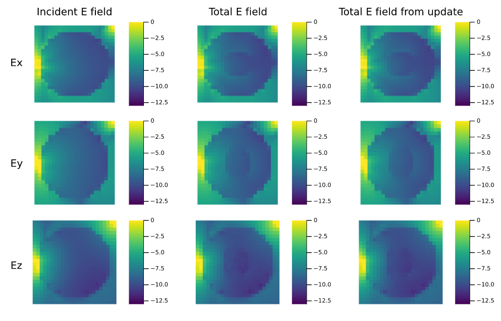

# DielectricUpdateTechique

## Background
This package exports functions to change the dielectric of electromagnetic simulations.
The method is based on the papers from  [J. van Gemert](https://doi.org/10.1109/TMI.2016.2624507) and
[P. Stijnman](https://doi.org/10.1002/mrm.28023). The first paper shows the application of the method on high permittivity pads used for magnetic resonance imaging. The second paper shows the application for testing the radiofrequency safety of medical implants in magnetic resonance imaging.

In short, the method calculates the changes in the radiofrequency fields that occur as a result of the change in dielectric properties (i.e. adding a pad or an implant) with respect to a base simulation. In the applications shown in the papers, the base simulation includes the antenna generating the radiofrequency fields and the patient anatomy. The change that is calculated is done on the domain where the change in the dielectric occurs rather than the entire simulation domain. This significantly accelerates the simulation process and allows for quickly evaluating different pad or implant positions/materials.

The difference between the method in the papers and the one in this package is that there is no need for any precomputations. This package replaces that requirement with a matrix-free minimization procedure.


## Usage
In general, the update method requires the conductivity and permittivity  of the background and desired scenario, the electric field of a base simulation that included some source and the background dielectric, the frequency of the incident electric field, and the uniform resolution of the grid.

```julia 
import DielectricUpdateTechique as DUTCH
prob = DUTCH.create_problem(BG_σ,BG_ϵr,Update_σ,Update_ϵr,Einc,frequency,res);
```

This will create a problem tuple that can be solved using a CPU.

```julia 
prob = DUTCH.create_problem_gpu(BG_σ,BG_ϵr,Update_σ,Update_ϵr,Einc,frequency,res);
```

This will create the same tuple, but one that can be solved using a GPU, for quicker simulation times.
The problem can be solved using:

```julia 
Jsc,Esc = DUTCH.solve_problem(prob,tol=1f-6);
```
Where the outputs are the scattered current density on the update domain, and the scattered electric field that corresponds to this current density inside the background dielectric.
Simply adding this scattered electric field to the incident electric field will result in the electric as if the simulation included the updated dielectric.

```julia 
Etot = Einc + Esc;
```

## Examples
First, we import some packages

```julia 
import DielectricUpdateTechique as DUTCH
using Plots 
```

Second, we set a frequency of the electromagnetic fields, and we create a grid of 25x25x25 cells.

```julia
frequency = 300f6;
np, nq, nr = [25,25,25];
hp, hq, hr = div.([np, nq, nr],2);

# create grid for the problem
res = [1f-3,1f-3,1f-3];
x_axis = -hp*res[1]:res[1]:hp*res[1] |> collect |> s -> repeat(s,outer=(1,nq,nr));
y_axis = -hq*res[2]:res[2]:hq*res[2] |> collect |> s -> reshape(s,(1,:))|> s -> repeat(s,outer=(np,1,nr));
z_axis = -hr*res[3]:res[3]:hr*res[3] |> collect |> s -> reshape(s,(1,1,:))|> s -> repeat(s,outer=(np,nq,1));
```

### Update outside the background dielectric
Next, we create a dielectric that we will use as a background

```julia
# create background dielectric (sphere within vacuum)
BG_σ = zeros(Float32,np,nq,nr);
BG_ϵr = ones(Float32,np,nq,nr);

# create the cube with σ = 0.15 S/m and ϵr = 40
BG_σ[hp-5:hp+5,hq-5:hq+5,hr-5:hr+5] .= 0.15;
BG_ϵr[hp-5:hp+5,hq-5:hq+5,hr-5:hr+5] .= 40;
```

Then we want to create the dielectric we want to end up with.

```julia
# create the scenario we want to obtain 
# a smaller sphere within the background dielectric
Update_σ = copy(BG_σ);
Update_ϵr = copy(BG_ϵr);

# the plate next to the cube that has σ = 5 S/m and ϵr = 10
Update_σ[hp+6:hp+8,hq-6:hq+6,hr-6:hr+6] .= 3;
Update_ϵr[hp+6:hp+8,hq-6:hq+6,hr-6:hr+6] .= 20;
```

The result should look something like this:


Now in order to create a base simulation that we can use our update method for we need some sources.

```julia
# define the source to calculate the incidenct electric field
source = zeros(ComplexF32,np*(nq-1)*(nr-1)+(np-1)*nq*(nr-1)+(np-1)*(nq-1)*nr);
source[7201] = 1f0 + 0f0im;
source[21601] = 0f0 + 1f0im;
source[35713] = 1f-1 + 3f-1im;
```

We can now solve for the electric field of our background simulation (incident electric field) and the electric field for the entire updated dielectric (total electric field) using a standard solver (i.e. volume integral equation method).

```julia
# calculate the incident and total electric field starting from vacuum surrounding.
Einc = DUTCH.calculate_electric_field_vacuum_to_dielectric(BG_σ,BG_ϵr,res,source,frequency);
Etot = DUTCH.calculate_electric_field_vacuum_to_dielectric(Update_σ,Update_ϵr,res,source,frequency);
```

However, we can also use the method described in the papers to transform the incident electric field into the total electric field.

```julia
prob = DUTCH.create_problem(BG_σ,BG_ϵr,Update_σ,Update_ϵr,Einc,frequency,res);
Jsc,Esc = DUTCH.solve_problem(prob,tol=1f-4);
Etot_update = Einc + Esc;
```

The only thing left to do is compare the electric fields, looking at the center slice we find:


Here we can observe that the change in dielectric also changes the electric field. Furthermore, the total field from the standard solver and the update method provide the same electric field.

In this small example, the acceleration that is obtained is rather small since the entire simulation domain and the domain where the change occurs are similar in size. When the domain size reduction is larger the acceleration that is obtained will be larger too. Examples from the papers demonstrate simulations that are done with a finite difference time domain method to be 2000x slower than this update method.

### Update inside the background dielectric
Here we will create a different background and desired dielectric.

```julia 
radius = sqrt.(x_axis.^2 + y_axis.^2 + z_axis.^2);

# create background dielectric (sphere within vacuum)
BG_σ = zeros(Float32,np,nq,nr);
BG_ϵr = ones(Float32,np,nq,nr);

# create the sphere with σ = 0.25 S/m and ϵr = 78
radius_sphere = 10f-3;
BG_σ[radius .< radius_sphere] .= 0.25;
BG_ϵr[radius .< radius_sphere] .= 78;

# create the scenario we want to obtain 
# a smaller sphere within the background dielectric
Update_σ = copy(BG_σ);
Update_ϵr = copy(BG_ϵr);

# the smaller sphere has σ = 1 S/m and ϵr = 300
radius_sphere = 4f-3;
Update_σ[radius .< radius_sphere] .= 1;
Update_ϵr[radius .< radius_sphere] .= 300;
```

The resulting dielectric scenarios:


We define a new source 

```julia 
source = zeros(ComplexF32,np*(nq-1)*(nr-1)+(np-1)*nq*(nr-1)+(np-1)*(nq-1)*nr);
source[7237] = 1f0 + 0f0im;
source[21637] = 0f0 + 1f0im;
source[35712] = 1f-1 + 3f-1im;
```

and solve for the electric fields using the standard solver and the update method.

```julia 
# calculate the incident and total electric field starting from vacuum surrounding.
Einc = DUTCH.calculate_electric_field_vacuum_to_dielectric(BG_σ,BG_ϵr,res,source,frequency);
Etot = DUTCH.calculate_electric_field_vacuum_to_dielectric(Update_σ,Update_ϵr,res,source,frequency);

# calculate the total electric field starting from the background dielectric 
prob = DUTCH.create_problem(BG_σ,BG_ϵr,Update_σ,Update_ϵr,Einc,frequency,res);
Jsc,Esc = DUTCH.solve_problem(prob,tol=1f-6);
Etot_update = Einc + Esc;
```

Where the resulting electric fields are:


